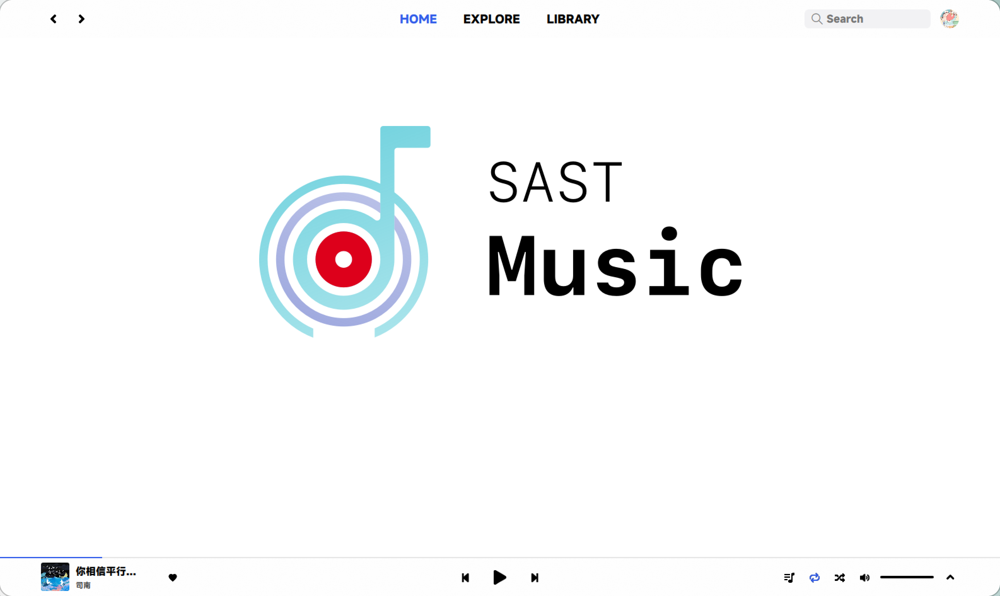
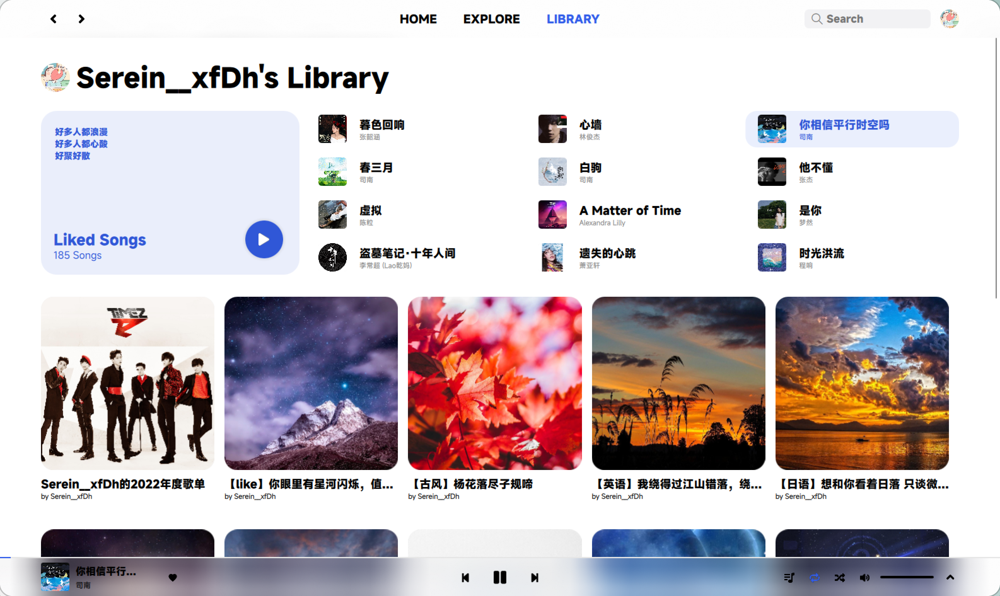
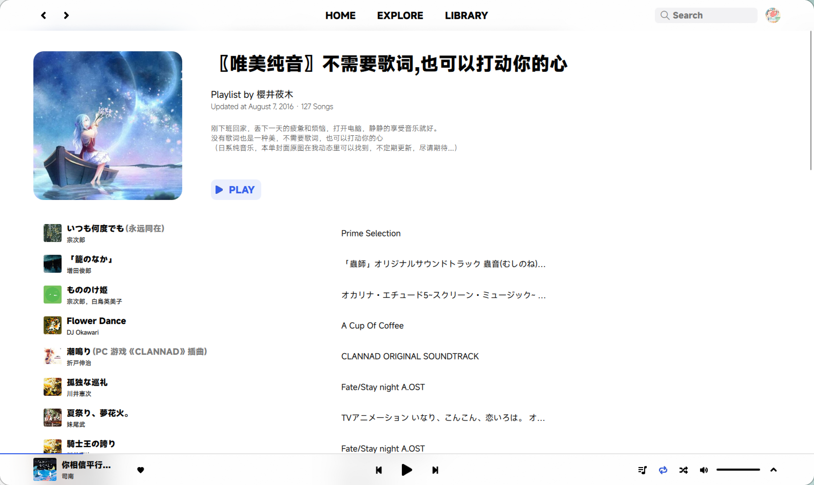
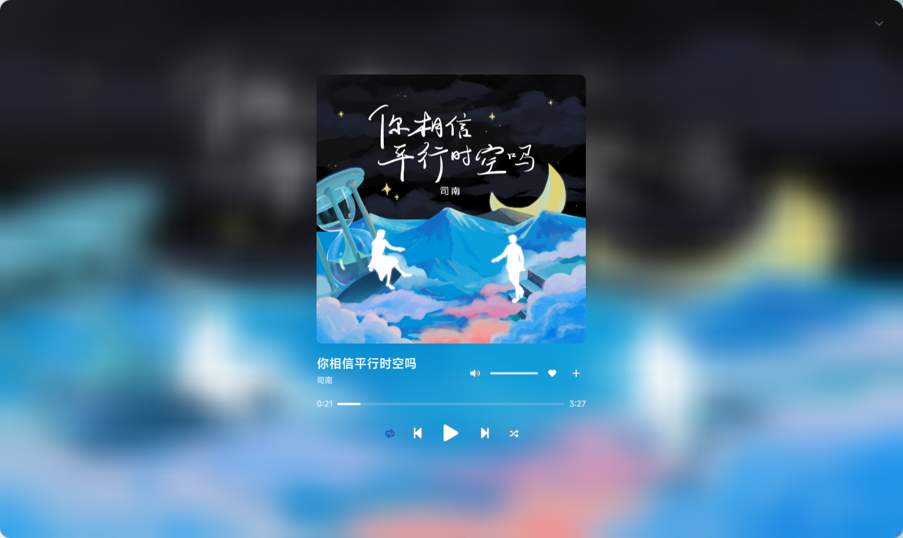

<div align=center>
  
</div>

<h1 align="center">
  SAST Music
</h1>
<p align="center">
  NJUPT SAST2023.C++ WoC
</p>

<p align="center">


</p>

## Brief

基于 Qt6 的桌面端云音乐播放器

> [!IMPORTANT]
>
> 本项目仅供交流学习使用，请于下载后 24 小时内删除

## Preview






## Clone

```bash
git clone --recursive https://github.com/NJUPT-SAST-Cpp/sast-music.git
```

注意：本项目使用了子模块，所以请确保使用 `--recursive` 参数来克隆仓库，或者在克隆后执行以下命令：

```bash
git submodule update --init --recursive
```

Use your IDE (QtCreator or CLion) to open. Only `CMake` support.

### 已知问题及解决方法

- **CMake `find_package` 报错**
    
    下载安装缺少的组件，例如 `Qt6::MultiMedia`

## Tasks & API Docs

[wiki](https://github.com/NJUPT-SAST-Cpp/sast-music/wiki/API-Docs)
